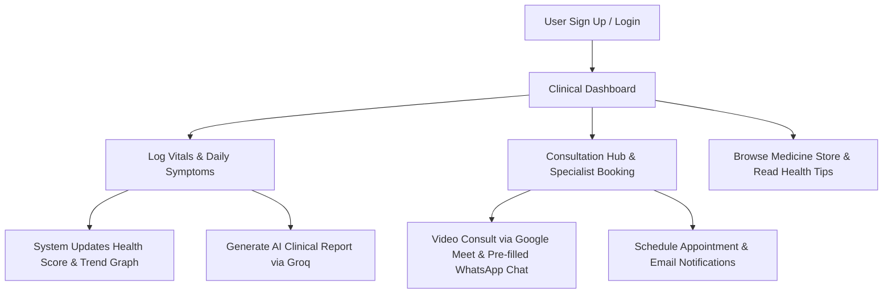

# 🩺 DocX - AI Smart Healthcare Assistant

[](https://www.djangoproject.com/)
[](https://www.python.org/)
[](https://groq.com/)
[](https://getbootstrap.com/)
[](https://sqlite.org/)

**DocX** is a cutting-edge, Django-powered Smart Healthcare Assistant and Clinical Decision Support System. It integrates advanced language modeling via the **Groq AI (Llama 3.1)** framework to provide patients with instant, structured clinical reports. The platform empowers users to monitor their health trends, log vitals, chat with medical specialists, book appointments, and browse over-the-counter medicine listings.

---

## 🏛️ Project Leadership

- **Lead Architect & Creator:** **Utkarsh Srivastav**
  *Responsible for end-to-end system architecture, AI integration, backend database models, and clinical dashboard design.*

---

## 🚀 Step-by-Step User Flow (What the Project Does)

Here is exactly how the application functions and how a patient interacts with the system:



### 1. Secure Authentication & Onboarding
- Patients begin by registering for a **Clinical Account** at `/signup/` and logging in at `/login/`.
- User profiles can be updated and viewed at `/profile/` to manage patient credentials.

### 2. Interactive Health & Vitals Monitoring
- **Symptom Logger:** Patients record their current symptoms and classify their severity (Low, Medium, High).
- **Vitals Logger:** Patients log raw vitals including **Heart Rate (BPM)**, **Blood Oxygen (SpO2 %)**, **Steps Count**, and **Weight (kg)**.
- **Dynamic Health Score:** The platform automatically aggregates the last 7 days of symptom logs to compute a dynamic health score (0-100%).
- **Diagnostic Insights:** Based on the score, a dynamic alert is displayed:
  - 🟢 **Excellent (Score >= 90):** Suggests maintaining current habits.
  - 🟡 **Stable (Score >= 70):** Indicates minor fluctuations.
  - 🟠 **Moderate Alert (Score >= 50):** Recommends rest and hydration.
  - 🔴 **Critical Alert (Score < 50):** Urges immediate medical consultation.
- **Trend Charts:** A beautiful, responsive visual graph (built using Chart.js) renders the 7-day health score trend for easy diagnostics.

### 3. AI-Powered Medical Summaries
- Powered by the **Groq Llama-3.1-8b-instant** API, the app features a **"Consult AI"** clinical evaluation engine.
- Upon submitting a symptom, it generates a structured **Medical Report Summary** containing:
  - **Chief Complaints** (User's inputs)
  - **Clinical Assessment** (Severity & potential triggers)
  - **Recommendations**
  - **Action Plan** (Immediate steps)
  - **Next Steps** (Monitoring protocols)
- *If the API is offline, a robust local rule-based diagnostic fallback is executed automatically.*

### 4. Telemedicine & Specialist Directory
- Users can browse a directory of active specialists covering **Internal Medicine**, **Cardiology**, **Neurology**, **Pediatrics**, **Psychiatry**, and **Orthopedics**.
- **One-Click Video Consultation:** Launches a Google Meet session.
- **Direct WhatsApp Chat Integration:** Automatically redirects the user to chat with the doctor, pre-filling the message with the patient's name and latest logged symptoms.
- **Appointment Scheduler:** Users can request a physical or digital appointment. Submitting this form triggers an automated HTML email notification using Gmail SMTP to notify administrators about the booking.

### 5. Pharmaceutical Store & Clinical Newsletter
- **Medicine Catalog:** Allows users to search and discover OTC pharmaceuticals categorized into Pain Relief, Antibiotics, Immunity, Digestion, Sleep Support, and Allergy.
- **Health Tips & Updates:** Provides professional self-care guides and features an SMTP-backed newsletter subscription for weekly health research.

---

## 🛠️ Technology Stack

- **Backend:** Python 3.8+, Django 4.2+ (MVC architecture, ORM, Forms, Authentication, Mail Service)
- **AI Engine:** Groq API (Llama-3.1-8b-instant model)
- **Database:** SQLite (default) or MySQL (configurable)
- **Frontend:** HTML5, CSS3 (Custom styles), JavaScript (ES6+), Chart.js (Data rendering), Bootstrap 5 (Responsive Layout)
- **Utilities:** Python-dotenv, Gunicorn, WhiteNoise

---

## 📁 Project Directory Structure

```
DocX-AI-Smart-Healthcare-Assistant-main/
├── core/                    # Main Clinical Application
│   ├── models.py           # SymptomEntry and VitalsRecord schemas
│   ├── views.py            # Core logic (AI interface, email bookings, dashboards)
│   ├── forms.py            # Patient registration, symptoms, and vitals forms
│   ├── urls.py             # App routing URLs
│   └── admin.py            # Django Admin registrations
├── templates/core/          # Responsive HTML Pages
│   ├── base.html           # Main Shell & Navigational structure
│   ├── signup.html         # User Registration
│   ├── login.html          # Login Panel
│   ├── dashboard.html      # Diagnostic Analytics Dashboard
│   ├── add_symptom.html    # Log Symptoms Form
│   ├── log_vitals.html     # Log Patient Vitals
│   ├── symptom_history.html# Historical Records & Archiving
│   ├── health_tips.html    # Health and Wellness guides
│   ├── doctor_contact.html # Telemedicine Directory
│   ├── consultation_hub.html # Teleconsultation (Meet/WhatsApp)
│   └── medicine_store.html # Pharmaceutical Store Front
├── docx_project/           # Project Configuration
│   ├── settings.py         # Main settings (SMTP, DB, Static root, API keys)
│   └── urls.py             # Base URL routes
├── static/                 # Stylesheet assets and images
│   └── css/
│       └── style.css       # Custom premium UI stylesheet
├── requirements.txt        # Python dependency manifest
└── manage.py               # Django administrative CLI
```

---

## 💻 Local Installation & Running Guide

### Prerequisites
- Python 3.8 or higher installed on your computer.

### Step 1: Clone and Enter the Project Directory
```cmd
git clone https://github.com/YOUR_USERNAME/DocX-AI-Smart-Healthcare-Assistant.git
cd DocX-AI-Smart-Healthcare-Assistant/DocX-AI-Smart-Healthcare-Assistant-main
```

### Step 2: Set Up the Environment
You can utilize the pre-configured virtual environment `venv`:
1. **Activate the Virtual Environment:**
   - On Windows:
     ```cmd
     venv\Scripts\activate
     ```
   - On macOS/Linux:
     ```bash
     source venv/bin/activate
     ```
2. **Install Dependencies:**
   ```bash
   pip install -r requirements.txt
   ```

### Step 3: Run Database Migrations
Create the SQLite database file and initialize all tables:
```bash
python manage.py migrate
```

### Step 4: Configure Environment Keys (Optional but Recommended)
To enable Groq AI diagnostics, set your API key as an environment variable:
- On Windows (CMD):
  ```cmd
  set GROQ_API_KEY=your_groq_api_key_here
  ```
- On Linux/macOS:
  ```bash
  export GROQ_API_KEY="your_groq_api_key_here"
  ```
*(Alternatively, create a `.env` file in the same directory as `manage.py` and add `GROQ_API_KEY=your_groq_api_key_here`).*

### Step 5: Create a Superuser Account (Optional)
If you want to access the admin panel to manage patients, vitals, and logs:
```bash
python manage.py createsuperuser
```

### Step 6: Start the Server
```bash
python manage.py runserver
```
The application will launch successfully at **`http://127.0.0.1:8000/`**.
